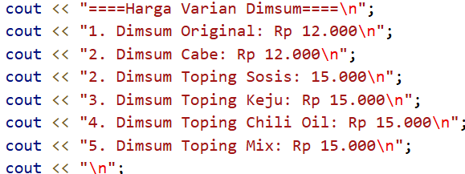
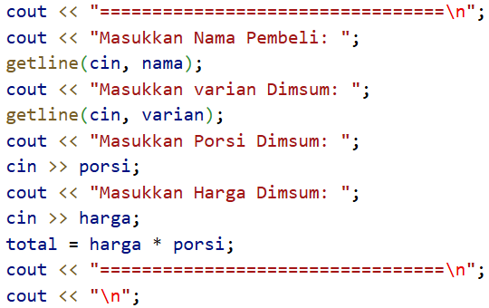
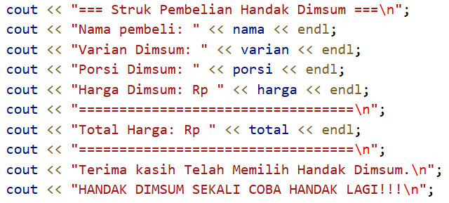
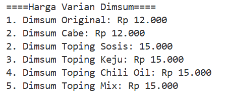
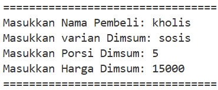
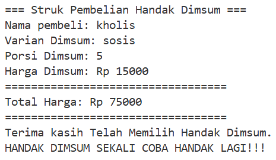

# PROGRAM KASIR HANDAK DIMSUM
Program ini adalah program kasir sederhana berbasis c++ untuk memudahkan penjualan dimsum.

## TIPE DATA & VARIABEL YANG DIGUNAKAN
string nama, varian;  
int harga, porsi, total;

## FITUR
1. Menampilkan varian dan harga menu
2. Meminta input pembeli
3. Menghitung total harga otomatis
4. Menampilkan struk pembelian

## CARA KERJA PROGRAM
1. Program akan menampilkan daftar harga varian dimsum 
   
   
2. User diminta mengisi data:  
   Nama Pembeli:  
   Varian Dimsum: 
   Porsi Dimsum:  
   Harga Dimsum:  
   
   
3. Program akan menghitung harga total otomatis dengan: 
   total = harga * porsi 

4. Program akan menampilkan struk pembelian  
   

## OUTPUT
1. 
2. 
3. 
