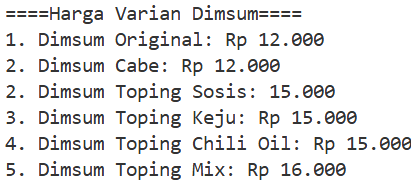
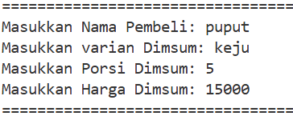
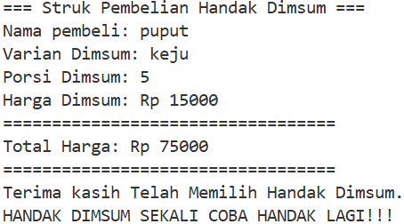

# PROGRAM KASIR HANDAK DIMSUM
Program ini adalah program kasir sederhana berbasis c++ untuk memudahkan penjualan dimsum.

## TIPE DATA & VARIABEL YANG DIGUNAKAN
string nama, varian; <br>
int harga, porsi, total;

## FITUR
1. Menampilkan varian dan harga menu
2. Meminta input dari pembeli (nama, varian, porsi, harga)
3. Menghitung total harga otomatis
4. Menampilkan struk pembelian

## CARA KERJA PROGRAM
1. Program akan menampilkan daftar harga varian dimsum<br>
```cpp
cout << "====Harga Varian Dimsum====\n";
cout << "1. Dimsum Original: Rp 12.000\n";
cout << "2. Dimsum Cabe: Rp 12.000\n";
cout << "2. Dimsum Toping Sosis: 15.000\n";
cout << "3. Dimsum Toping Keju: Rp 15.000\n";
cout << "4. Dimsum Toping Chili Oil: Rp 15.000\n";
cout << "5. Dimsum Toping Mix: Rp 16.000\n";
cout << "\n";
```
   
2. User diminta mengisi data: <br>
```cpp
cout << "=================================\n";
    cout << "Masukkan Nama Pembeli: ";
    getline(cin, nama);
    cout << "Masukkan varian Dimsum: ";
    getline(cin, varian);
    cout << "Masukkan Porsi Dimsum: ";
    cin >> porsi;
    cout << "Masukkan Harga Dimsum: ";
    cin >> harga;
    total = harga * porsi;
    cout << "=================================\n";
    cout << "\n";
```

3. Program akan menghitung harga total otomatis dengan:<br>
   total = harga * porsi;


4. Program akan menampilkan struk pembelian <br>
```cpp
cout << "=== Struk Pembelian Handak Dimsum ===\n";
cout << "Nama pembeli: " << nama << endl;
cout << "Varian Dimsum: " << varian << endl;
cout << "Porsi Dimsum: " << porsi << endl;  
cout << "Harga Dimsum: Rp " << harga << endl;
cout << "==================================\n";
cout << "Total Harga: Rp " << total << endl;
cout << "==================================\n";
cout << "Terima kasih Telah Memilih Handak Dimsum.\n";
cout << "HANDAK DIMSUM SEKALI COBA HANDAK LAGI!!!\n";
```

## OUTPUT
1. 
2. 
3. 